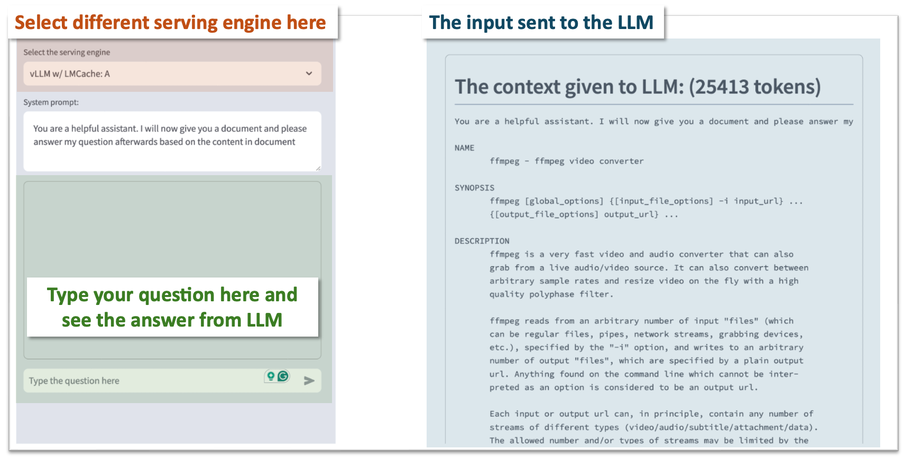
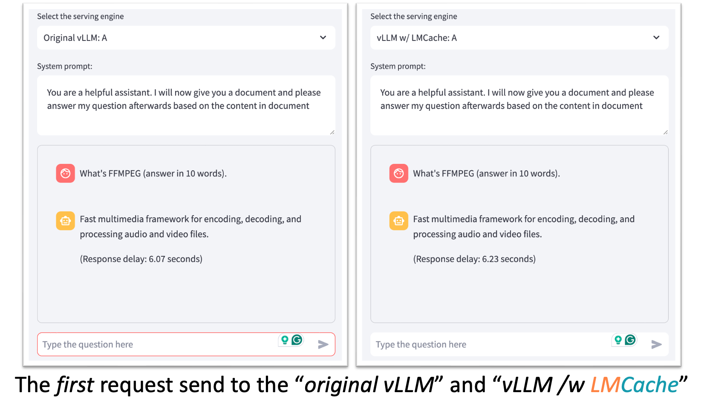
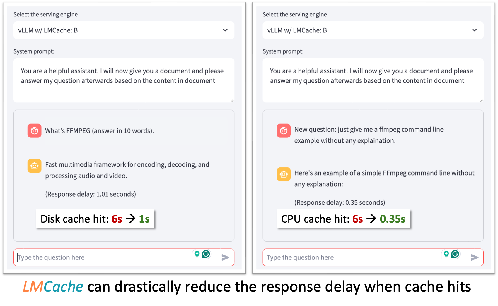

# Speedup vLLM with LMCache

## introduction

**After this quick 3-minute example, you will know how to install LMCache and demonstrate that it speeds up the inference by 6-17X.**


As shown in the above figure, this demo shows that different vLLM instances can share the prefix KV cache between each other by using LMCache on a single node, so that the KV cache generated by one vLLM instance can be reused by another.

Note that though this demo focuses on single-node case, it can be generalized to allow KV cache sharing between any two vLLM instances in the cluster, as long as they have a commonly-shared NFS disk.

## Prerequisites

- 4 Nvidia A6000 or A40 GPU on the same machine
- Local SSD disk with peak IO bandwidth > 3GB/s (typical speed for SATA3 SSDs)
- docker compose installed on the machine
- sudo access to run docker compose up
- A huggingface token with access to mistralai/Mistral-7B-Instruct-v0.2.
  - _Note: For more information on Huggingface login, please refer to the [Huggingface documentation.](https://huggingface.co/docs/huggingface_hub/en/quick-start)_

Run the demo
```bash
git clone https://github.com/LMCache/demo.git
cd demo/demo4-compare-with-vllm
echo "HF_TOKEN=<your HF token>" >> .env
sudo docker compose up --build -d
timeout 300 bash -c ` until curl -X POST \
    localhost:8000/v1/completions > /dev/null 2>&1; \
    do \
    echo "waiting for server to start..." \
    sleep 1 \
    done` # wait for the docker compose to be ready for receiving requests
```

Please replace <your HF token> with your huggingface token in the bash script above.


## Send your requests to different serving engines

This demo will `preheat` the inference engine by sending them some dummy requests. After `preheat` finishes, you will see the following UI:



- You can select different serving engines in the orange area
  - Original vLLM: (A)
  - Original vLLM: (B)
  - vLLM w/ LMCache (A)
  - vLLM w/ LMCache (B)
- You can ask the LLM questions in the green area.
- The right-hand side (blue area) shows the “context” of the query sent to the LLM.

You can try sending different requests to different serving engines.

## Steps to follow:


### Using only vLLM can be slow

1. Choose Original vLLM: (A) and type query: “What’s FFMPEG (answer in 10 words)”
2. Choose Original vLLM: (B) and type query: “New question: just give me a ffmpeg command line example without any explanation”
  
You should be able to see the following results, where the request to Original vLLM: (A) and to Original vLLM: (B) have the same response delay.



### vLLM + LMCache speeds up inference by KV cache sharing


1. Choose vLLM w/ LMCache: (A) and type query: “What’s FFMPEG (answer in 10 words)”
2. Choose vLLM w/ LMCache: (B) and type query: “New question: just give me a ffmpeg command line example without any explanation”

You should be able to see the following results, where vLLM + LMCache accelerates the inference on vLLM w/ LMCache: (B) by 6-17$\times$, depending on the storage device.



## Clean up
Use Ctrl+C to terminate the frontend, and then run sudo docker compose down to shut down the service.

## Customise the configuration
Note that this demo runs the model mistralai/Mistral-7B-Instruct-v0.2 and stores KV cache under directory /tmp. You can customize these two entires by editing the file .env under demo4-compare-with-vllm.

## Known issues
Currently, LMCache may impact the decoding speed of the vLLM when storing the KV cache to the disk. This is a known issue, and can be solved by better async implementation soon.
