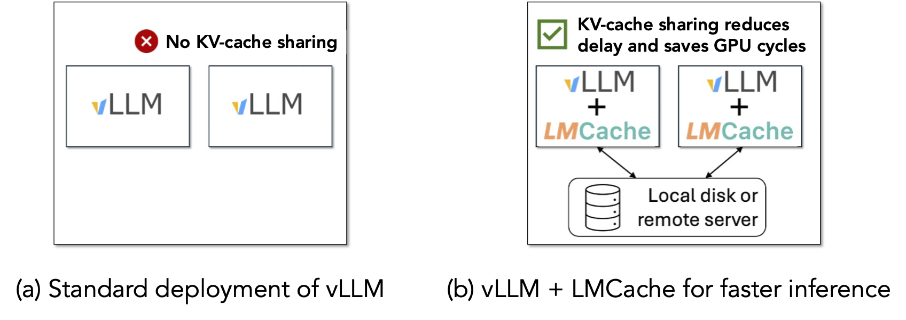

# Speedup vLLM with LMCache

## introduction

**After this quick 3-minute example, you will know how to install LMCache and demonstrate that it speeds up the inference by 6-17X.**




As shown in the above figure, this demo shows that different vLLM instances can share the prefix KV cache between each other by using LMCache on a single node, so that the KV cache generated by one vLLM instance can be reused by another.

Note that though this demo focuses on single-node case, it can be generalized to allow KV cache sharing between any two vLLM instances in the cluster, as long as they have a commonly-shared NFS disk.

## Prerequisites

- 4 Nvidia A6000 or A40 GPU on the same machine
- Local SSD disk with peak IO bandwidth > 3GB/s (typical speed for SATA3 SSDs)
- docker compose installed on the machine
- sudo access to run docker compose up
- A huggingface token with access to mistralai/Mistral-7B-Instruct-v0.2.
  - _Note: For more information on Huggingface login, please refer to the [Huggingface documentation.](https://huggingface.co/docs/huggingface_hub/en/quick-start)_

Run the demo
```bash
git clone https://github.com/LMCache/demo.git
cd demo/demo4-compare-with-vllm
echo "HF_TOKEN=<your HF token>" >> .env
sudo docker compose up --build -d
timeout 300 bash -c 'until curl -X POST 
    localhost:8000/v1/completions > /dev/null 2>&1; 
    do 
    echo "waiting for server to start..." 
    sleep 1 
    done' # wait for the docker compose to be ready for receiving requests
```

Please replace <your HF token> with your huggingface token in the bash script above.


## Send your requests to different serving engines

The command above will start 3 different serving engines, each having a web frontend that you can interact with.
- vLLM w/ LMCache (A) --- web frontend runs at `http://<Your server IP>:8501`
- vLLM w/ LMCache (B) --- web frontend runs at `http://<Your server IP>:8503`
- Original vLLM w/ LMCache (B) --- web frontend runs at `http://<Your server IP>:8502`

This demo will `preheat` the inference engine by sending them some dummy requests. After `preheat` finishes, you will see the following UI:


- The orange area shows which serving engine are you using now.
- You can ask the LLM questions in the green area.
- The right-hand side (blue area) shows the “context” of the query sent to the LLM.

You can try sending different requests to different serving engines.


## Steps to follow:

### Send the first request to vLLM w/ LMCache (A)

1. Open `http://<Your server's IP>:8501` (corresponds to the serving engine `vLLM w/ LMCache (A)`)
2. Type query: “What’s FFMPEG (answer in 10 words)”
   
You should be able to see the following results with a response delay of around 6 seconds.


### What if the original vLLM gets a new request with the **same** context

1. Open `http://<Your server's IP>:8502` (corresponds to the serving engine `original vLLM`)
2. Type query: Summarize FFMPEG's main feature in 10 words
   
You should be able to see the following results with a response delay still of around 6 seconds.


### What if the vLLM w/ LMCache (B) gets a new request with the **same** context

1. Open `http://<Your server's IP>:8503` (corresponds to the serving engine `vLLM w/ LMCache (B)`)
2. Type query: Summarize FFMPEG's main feature in 10 words
    - You should be able to see the following results with a response delay still of less than 1 second, which is 6x faster than the original vLLM.
3. Type another query: just give me a ffmpeg command line example without any explanation
    - You should be able to see the following results with a response delay still of around 0.35 seconds, which is 15x faster than the original vLLM.


## Clean up
Use Ctrl+C to terminate the frontend, and then run sudo docker compose down to shut down the service.

## Customise the configuration
Note that this demo runs the model mistralai/Mistral-7B-Instruct-v0.2 and stores KV cache under directory /tmp. You can customize these two entires by editing the file .env under demo4-compare-with-vllm.
