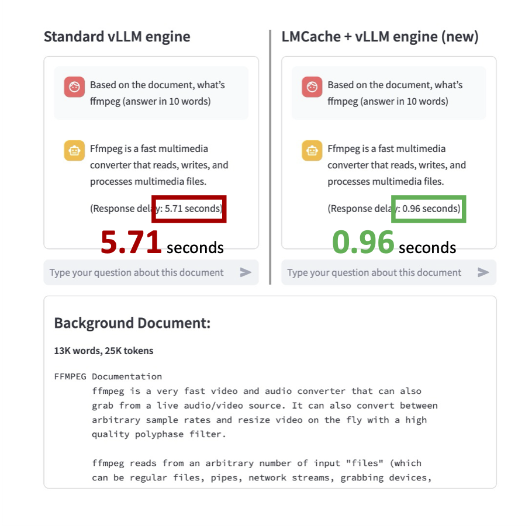

# Speedup vLLM with LMCache

## Introduction

**After this quick 3-minute example, you will know how to install LMCache and demonstrate that it speeds up the inference by 6X.**


As shown in the above figure, this demo shows that different vLLM instances can share the prefix KV cache between each other by using LMCache on a single machine, so that the KV cache generated by one vLLM instance can be reused by another.

Note that though this demo focuses on single-machine case, it can be generalized to allow KV cache sharing between any two vLLM instances in the cluster, as long as they have a commonly-shared NFS disk.

## Prerequisites

- 4 Nvidia A6000 or A40 GPU on the same machine
- Local SSD disk with peak IO bandwidth > 3GB/s (typical speed for SATA3 SSDs)
- [docker compose](https://docs.docker.com/compose/install/) installed on the machine
- sudo access to run ``docker compose up``
- A huggingface token with access to ``mistralai/Mistral-7B-Instruct-v0.2``. 
- A local Python environment which can run ``pip install``.
- [Docker NVIDIA Runtime](https://docs.nvidia.com/datacenter/cloud-native/container-toolkit/latest/install-guide.html) installed on the machine.
  > **_NOTE:_** For more information on Huggingface login, please refer to the [Huggingface documentation.](https://huggingface.co/docs/huggingface_hub/en/quick-start)_

### Run the demo
```bash
$ git clone https://github.com/LMCache/demo.git
$ cd demo/demo4-compare-with-vllm
$ echo "HF_TOKEN=<your HF token>" >> .env
$ pip install streamlit openai transformers sentencepiece
$ sudo docker compose up -d
$ bash start_ui.sh
```

Please replace <your HF token> with your huggingface token in the bash script above.

> **_NOTE:_** If model weights are not downloaded, they might need to be dowloaded manually. This prevents 
    multiple serving engines from downloading the same model weights and cause potential write conflicts.
    For this you can use:

```python 
from transformers import AutoModelForCausalLM, AutoTokenizer

model_name = "mistralai/Mistral-7B-Instruct-v0.2"
model = AutoModelForCausalLM.from_pretrained(model_name)
tokenizer = AutoTokenizer.from_pretrained(model_name)

cache_dir = "~/.cache/huggingface/"

model.save_pretrained(cache_dir)
tokenizer.save_pretrained(cache_dir)
```

> **_NOTE:_** Refer to the [Model saving](https://huggingface.co/docs/transformers/main/en/main_classes/model#transformers.PreTrainedModel.save_pretrained)
for more information.

Once you see the following line ``You can now view your Streamlit app in your browser``, open your browser 
and view the webUI at the following URLs:

```bash
LOCAL_URL http://localhost:8501
NETWORK_URL http://<YOUR IP>:8501
EXTERNAL_URL http://<YOUR IP>:8501
```

### What happens when you run the demo?

<p style="text-align:justify">
    After you run the script above, two serving engine instances, a <b>standard vLLM</b> and a <b>LMCache-enabled vLLM</b>, are now 
    started on two GPUs. Each instance is warmed-up with one query on a long document, which will be reused as the context later.
    <!-- One of them is a standard vLLM engine and the other is an LMCache + vLLM engine. -->
</p>

When you open the WebUI on the browser on <b> http://localhost:8501</b>, it triggers the backend to start 
two <b> new</b> engine instances, a second <b>standard vLLM</b> and a second <b>LMCache-enabled vLLM</b>
on the two <b>unused</b> GPUs. Note that the standard vLLM does <b>not</b> share KV cache across different GPUs.
</p>


<!-- img width="852" alt="image" src="https://github.com/user-attachments/assets/380c401b-8f10-4fab-bd17-dd67b1fbca29" -->

### What steps do you need to perform?

For the demo, let's issue the same query as follows to both engines, and see which one is FASTER! 

``Based on the document, what's ffmpeg (answer in 10 words)``

(In this case, the default context of the queries is a ``ffmpeg`` manual.)

Type in the query to both Standard vLLM Engine ``(on the left)`` and LMCache + vLLM Engine (new) ``(on the right)``
and see the speedup for yourself!



You will see that the LMCache + vLLM Engine (New) is almost **6X faster** than the Standard vLLM Engine.

## Clean up
Use ``Ctrl+C`` to terminate the frontend, and then run ``sudo docker compose down`` to shut down the service.
